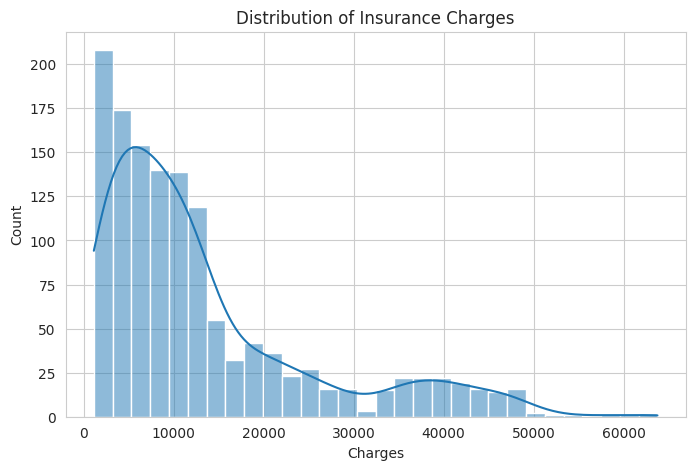
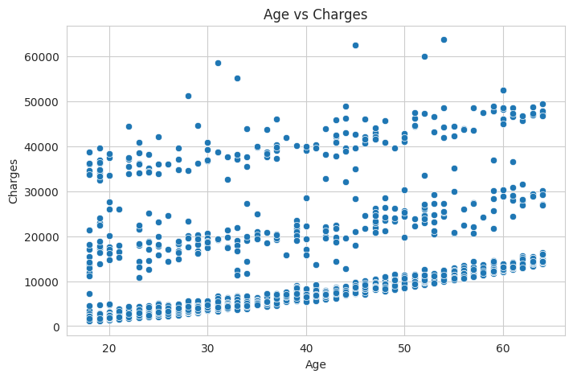
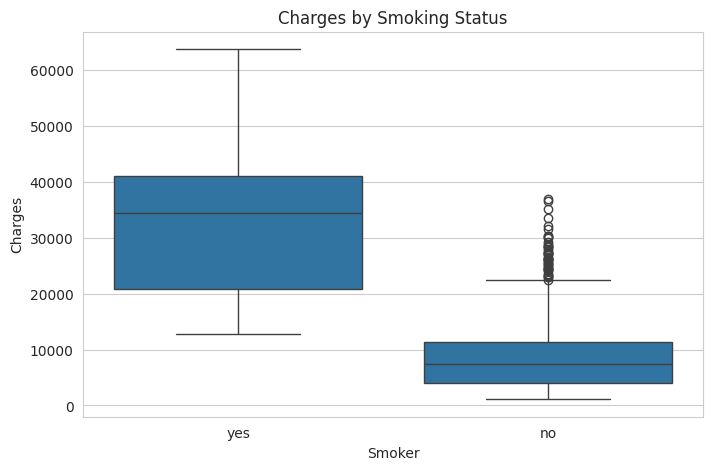
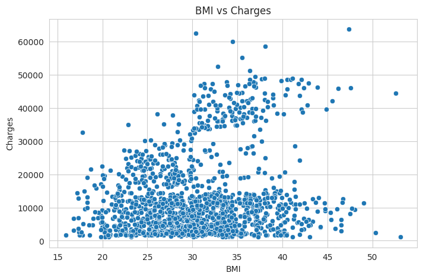
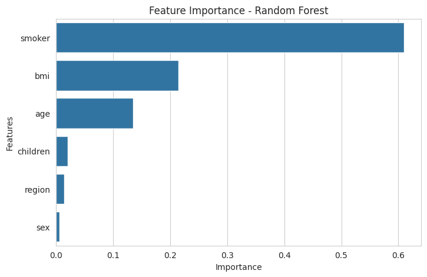

# Medical Insurance Cost Analysis and Prediction

This project explores the key factors influencing medical insurance charges using **Exploratory Data Analysis (EDA)** and **machine learning techniques**. The goal is to understand how demographic and lifestyle features affect insurance costs and to build predictive models capable of estimating medical insurance charges.

---

## Project Overview

Healthcare costs can vary significantly depending on multiple factors such as **age, BMI, smoking status, and region**. In this project, we analyze a medical insurance dataset to identify the most important variables affecting insurance costs and develop machine learning models to predict medical charges.

---

## Dataset

The dataset contains demographic and lifestyle information about individuals along with their medical insurance charges.

**Features included in the dataset:**

- **age** – Age of the individual  
- **sex** – Gender  
- **bmi** – Body Mass Index  
- **children** – Number of children covered by insurance  
- **smoker** – Smoking status  
- **region** – Residential region  
- **charges** – Medical insurance cost (target variable)

**Dataset source:** Kaggle – *Medical Cost Personal Dataset*

---

## Exploratory Data Analysis (EDA)

Exploratory data analysis was performed to understand relationships between variables and medical insurance charges.

**Key questions explored:**

- How are insurance charges distributed?
- Does smoking significantly increase insurance costs?
- How does age affect medical insurance charges?
- Is BMI associated with higher medical costs?
- Are there significant outliers in insurance charges?

---

## Key Visualizations

### Distribution of Insurance Charges



This visualization shows the distribution of insurance costs across individuals. The distribution is **right-skewed**, indicating that most individuals have relatively lower charges while a smaller number of individuals have significantly higher costs.

---

### Age vs Insurance Charges



The scatter plot shows a **positive relationship** between age and insurance charges. As age increases, insurance costs generally tend to increase.

---

### Charges by Smoking Status



Smoking status has the **strongest impact** on insurance costs. Smokers have significantly higher medical charges compared to non-smokers.

---

### BMI vs Insurance Charges



Individuals with higher BMI values tend to have higher insurance charges, suggesting that health risk factors contribute to increased medical expenses.

---

### Correlation Heatmap


The correlation matrix shows that **smoking status has the strongest correlation** with insurance charges, followed by **age** and **BMI**.

---

### Feature Importance



Feature importance from the **Random Forest** model confirms that **smoking status**, **BMI**, and **age** are the most influential variables affecting insurance costs.

---

## Machine Learning Models

Two machine learning models were implemented and compared.

### Baseline Model
**Linear Regression**

### Proposed Model
**Random Forest Regressor**

Random Forest was selected as the proposed model because it can **capture nonlinear relationships between variables** and is **more robust to outliers** compared to linear models.

---

## Model Performance

| Model | MAE | RMSE | R² Score |
|------|------|------|------|
| Linear Regression | 4182.35 | 5957.61 | 0.81 |
| Random Forest | 2546.22 | 4625.55 | 0.88 |

The **Random Forest model achieved better predictive performance** and was selected as the final model.

---

## Feature Importance

Feature importance from the Random Forest model confirms the findings from the exploratory data analysis.

The most influential features affecting insurance charges are:

1. **Smoking status**
2. **BMI**
3. **Age**
4. **Number of children**
5. **Region**
6. **Sex**

Smoking status is by far the **most influential variable affecting medical insurance costs**.

---

## Key Insights

- Smoking significantly increases medical insurance costs.
- Higher BMI values are associated with higher medical expenses.
- Insurance costs generally increase with age.
- Some regions show slightly higher average insurance charges.
- Outliers represent real-world high medical costs and were therefore retained in the dataset.

---

## Technologies Used

- Python
- Pandas
- NumPy
- Matplotlib
- Seaborn
- Scikit-learn

---

## Project Structure

```
medical-insurance-cost-analysis
│
├── important_visualizations
│ ├── charges_distribution.png
│ ├── age_vs_charges.png
│ ├── bmi_charges.png
│ ├── smoker_charges.png
│ ├── Correlation Heatmap.png
│ └── feature_importance.png
│
├── medical_insurance_cost_analysis.ipynb
├── insurance.csv
├── README.md
└── .gitattributes
```

## Conclusion

This project demonstrated how **exploratory data analysis and machine learning** can be used to understand and predict medical insurance costs. The analysis revealed that **smoking status, BMI, and age** are the most influential factors affecting insurance charges. The **Random Forest model achieved the best predictive performance**, highlighting its ability to capture complex relationships within the data.
